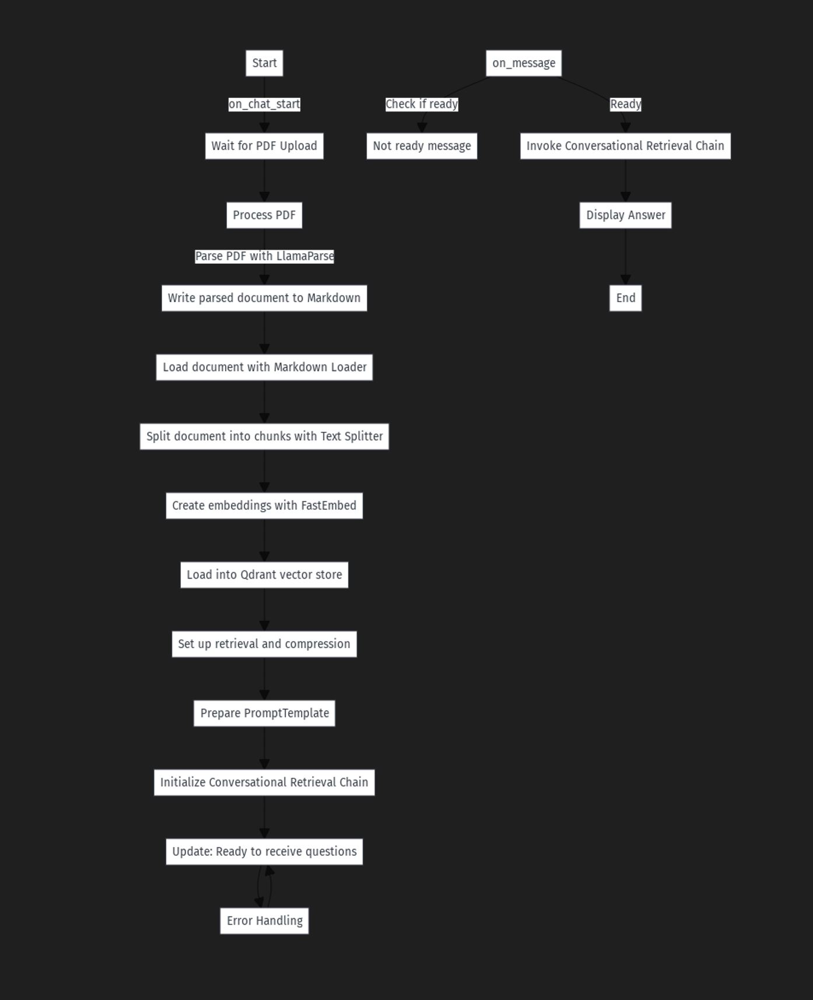

# Data Dialoguer: An Interactive Chatbot for Conversing with Your Data

## An Interactive Chatbot for Conversing with Your Data using Advanced RAG with Llama 3

This project implements an interactive chatbot designed to converse with your data using advanced Retrieval-Augmented Generation (RAG) techniques. Leveraging the power of Llama 3, the system processes PDF documents, generates embeddings, and provides precise answers to user queries based on the parsed content. The chatbot is built using a combination of Chainlit, LangChain, Qdrant, and other state-of-the-art technologies.

## Features

- **PDF Upload and Parsing**: Upload PDF files, and the chatbot will parse the content and convert it into a usable format.
- **Document Embedding**: Use advanced embeddings to represent document chunks for efficient retrieval.
- **Conversational Retrieval**: Engage in a conversation where the chatbot retrieves and provides contextually relevant information from the documents.
- **Memory Management**: Maintain conversation history to provide coherent and context-aware responses.
- **Interactive Interface**: User-friendly interface for easy interaction and query submission.

## Architecture

Below is a flowchart illustrating how the system works:



## Installation

Follow these steps to set up the project:

1. **Clone the Repository**:
    ```sh
    git clone https://github.com/nitish20899/chatbot_own_data.git
    cd your-repo
    ```

2. **Install Dependencies**:
    Ensure you have Python 3.8+ installed. Then, install the required Python packages:
    ```sh
    pip install -r requirements.txt
    ```

3. **Set Environment Variables**:
    Configure the necessary API keys and environment variables. Create a `.env` file in the project root and add the following:
    ```sh
    GROQ_API_KEY=<your key>
    LLAMAPARSE_API_KEY=<your key>
    UPLOAD_DIR=/path/to/your/upload/directory
    ```

4. **Run the Application**:
    Start the Chainlit application:
    ```sh
    python main.py
    ```

## Usage

1. **Start the Chatbot**:
    Open your browser and navigate to `http://localhost:8500`. 

2. **Upload a PDF**:
    Click the upload button and select a PDF file to upload. The chatbot will start processing the document.

3. **Ask Questions**:
    Once processing is complete, you can start asking questions about the content of the uploaded PDF. The chatbot will provide precise answers based on the document's information.

## Code Structure

- `main.py`: The main script to run the Chainlit application.
- `llama_parse.py`: Module for parsing documents using Llama Parse.
- `requirements.txt`: List of required Python packages.
- `README.md`: This file.

## Technologies Used

- **Chainlit**: Framework for creating conversational agents.
- **LangChain**: Toolkit for building language model applications.
- **Qdrant**: High-performance vector database for embedding storage and retrieval.
- **llamaparse**: parsing service that is incredibly good at parsing PDFs with complex tables into a well-structured markdown format.
- **Llama 3 70B**: Advanced language model for parsing and answering questions.

## Contributing

We welcome contributions to enhance the functionality and features of this project. Please follow these steps to contribute:

1. Fork the repository.
2. Create a new branch (`git checkout -b feature/YourFeature`).
3. Commit your changes (`git commit -m 'Add some feature'`).
4. Push to the branch (`git push origin feature/YourFeature`).
5. Open a Pull Request.

## Contact

For any questions or inquiries, please open an issue or contact the project maintainer at [nitishkumar2902@gmail.com].

---
